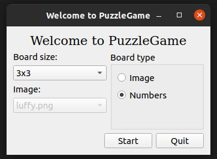
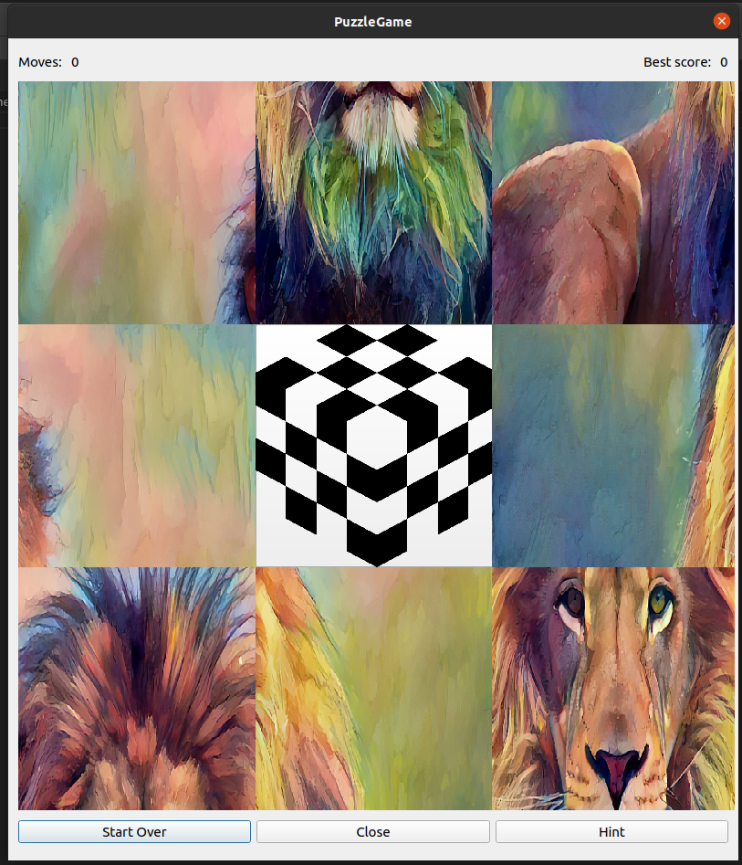
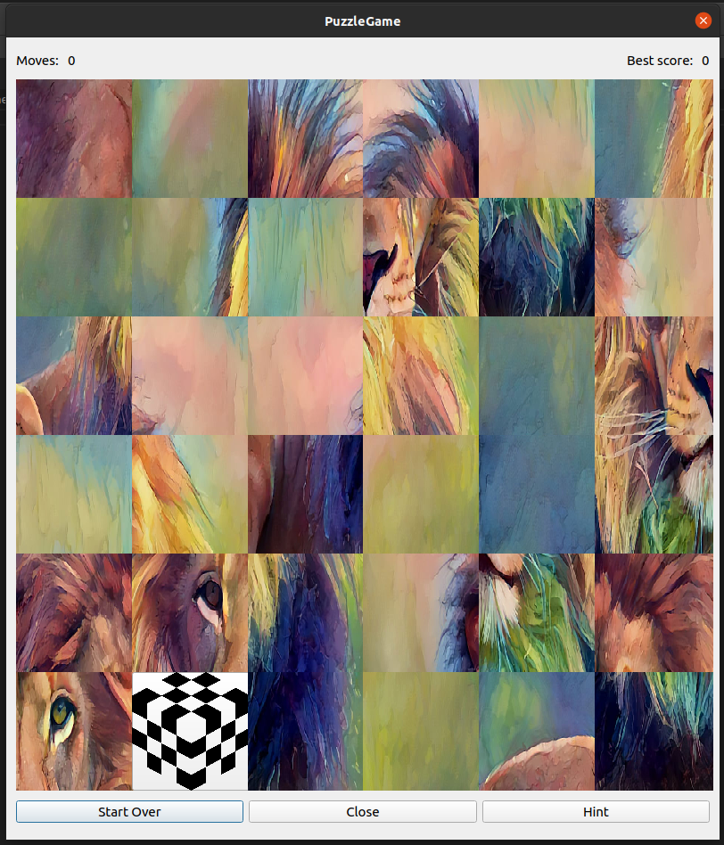
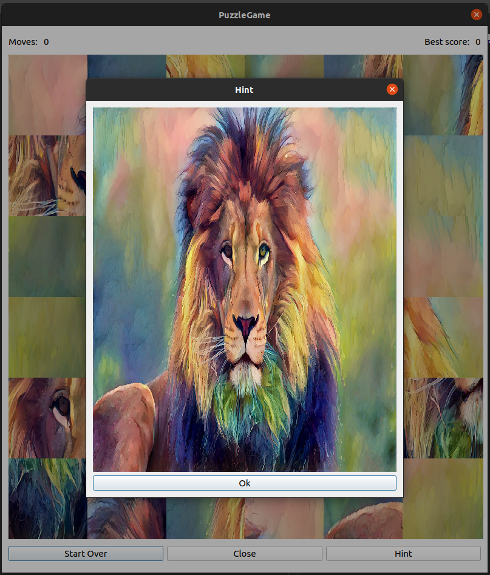

# PuzzleGame using Qt
## Description

This is a puzzle game developed in the Qt framework. The game includes three interfaces:
    - The welcoming dialog
    - The main game dialg
    - The hing dialog

The Welcoming dialg enables the player to choose different settings for the game such as the size of the board and the mode of the game. The board size ranges from 3x3 to 10x10 while the mode can be image or numbers. If the image mode is activated the player can choose an image for the puzzle. The following images shows the welcome dialog.

In the main game dialog, the player can move the the empty tile around to reorder the tiles to the original images or order the numbers horizontally. In the image mode the player can look at hint as well. The player has the ability also to reshuffle the tiles and restart the game by pressing the start over button.

## Build and Run
To build and run this game, Qt Creator is needed. The game was built using Qt5. 

## Disclaimer: I do not own the copy rights of any of the images used in this project. 
